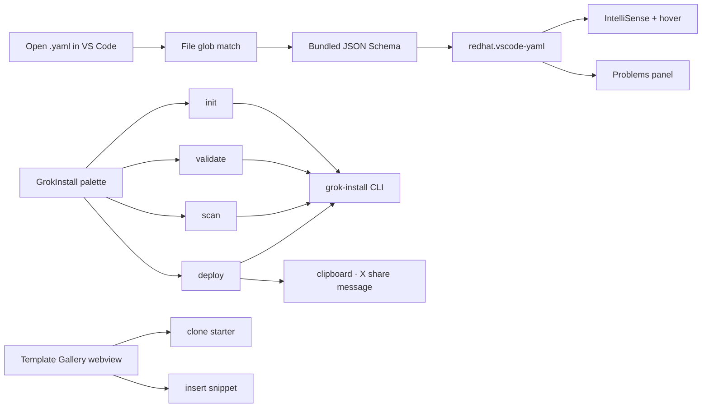

<!-- NEON / CYBERPUNK REPO TEMPLATE · VSCODE-GROK-YAML -->

  

<h1 align="center">⚡ GrokInstall YAML for VS Code</h1>

  <b>Go from empty folder to shipped agent without leaving the editor.</b> 
  Schema-aware IntelliSense · inline diagnostics · safety scanning · glassmorphic template gallery.

  

  
  
  
  
  

  

---

## ✦ Screenshots

| | |
| --- | --- |
|  |  |
|  |  |

<b>Screenshot captions</b>

- **Top-left:** IntelliSense completing a `reply_to_mention` key
- **Top-right:** Hover tooltip on `voice_profile.tone`
- **Bottom-left:** Scanner flagging a rate-limit risk
- **Bottom-right:** Glassmorphic template gallery panel

Assets marked as placeholders are dropped in by Claude Design before publish — see `PUBLISH.md`.

## ✦ Features

<table>
  <tr>
    <td width="50%">
      <h3>🧠 Schema-Backed IntelliSense</h3>
      
Completion, hover docs, and inline diagnostics for all five Grok spec formats — powered by the bundled <code>redhat.vscode-yaml</code> dependency.

    </td>
    <td width="50%">
      <h3>🛡️ Safety Scanner Integration</h3>
      
Runs <code>grok-install scan</code> with severity-aware notifications and a streaming output log. Ship safer agents by default.

    </td>
  </tr>
  <tr>
    <td>
      <h3>⌨️ Command Palette Coverage</h3>
      
Eight <code>GrokInstall:</code> commands — init, validate (file + project), scan, deploy, copy install link, share.

    </td>
    <td>
      <h3>📝 Context-Aware Snippets</h3>
      
Five prefixes expand into schema-valid defaults with tab stops — reply, thread, voice, trend, swarm.

    </td>
  </tr>
  <tr>
    <td>
      <h3>🎨 Glassmorphic Template Gallery</h3>
      
Clone starter projects or drop a snippet into the current file. Dark-premium UI, live-previewable.

    </td>
    <td>
      <h3>🔗 One-Click Share</h3>
      
Deploy copies a ready-to-post X message with your install link to the clipboard. Zero friction from ship to share.

    </td>
  </tr>
</table>

## ✦ Supported Spec Files

  
  
  
  
  

## ✦ How It Works

## ✦ Commands

Every command is prefixed `GrokInstall:` in the palette.

| Command | Suggested shortcut | What it does |
|---|---|---|
| `New Agent from Template` | `Cmd+Alt+N` | Wizard (name + category) then runs `grok-install init` in a terminal |
| `Validate Current Spec` | `Cmd+Alt+V` | Validates the active file, pushes diagnostics into Problems |
| `Validate Entire Project` | `Cmd+Alt+Shift+V` | Scans the full workspace with `grok-install validate --project` |
| `Run Safety Scanner` | `Cmd+Alt+S` | Runs `grok-install scan` with progress notifications |
| `Deploy Agent` | `Cmd+Alt+D` | Deploys, copies a ready-to-post X share message |
| `Copy Install Link` | `Cmd+Alt+L` | Generates and copies the install link to clipboard |
| `Open grokagents.dev Marketplace` | — | Opens the public marketplace in your browser |
| `Open Template Gallery` | `Cmd+Alt+G` | Opens the glassmorphic template gallery webview |

> Assign the shortcuts from `File > Preferences > Keyboard Shortcuts` — the suggestions above are not pre-bound to avoid stomping your setup.

## ✦ Snippets

Type any of the prefixes below inside a `.yaml` file. The snippet fills in schema-valid defaults with tab stops for quick customization.

| Prefix | Expands into | Target file |
|---|---|---|
| `grok:reply` | `capabilities.reply_to_mention` block | `capabilities.yaml` |
| `grok:thread` | `thread_posting` + `post_thread` | `grok-agent.yaml` |
| `grok:voice` | Full `voice_profile` + `response` block | `grok-voice.yaml` |
| `grok:trend` | `trend_pipeline` + `post_thread` combo | `grok-agent.yaml` |
| `grok:swarm` | `orchestrator` + `agents` + `fallback` | `grok-swarm.yaml` |

## ✦ Install

<table>
  <tr>
    <td width="33%">
      <h3>1️⃣ Extension</h3>
      
Install <b>GrokInstall YAML</b> from the VS Code Marketplace.

    </td>
    <td width="33%">
      <h3>2️⃣ CLI</h3>
      
<code>npm install -g grok-install</code>

    </td>
    <td width="33%">
      <h3>3️⃣ First Agent</h3>
      
Command palette → <b>GrokInstall: New Agent from Template</b>.

    </td>
  </tr>
</table>

## ✦ Why GrokInstall?

GrokInstall turns a YAML spec into a shippable Grok agent on X. The CLI handles validation, safety scanning, and deployment. **This extension puts that entire loop inside your editor** — author with IntelliSense, catch issues before `deploy`, and share an install link that lets anyone install your agent with a single click.

The full stack is open and independent:

<table>
  <tr>
    <td width="25%">
      <h3>📦 Core Spec</h3>
      <a href="https://github.com/AgentMindCloud/grok-install">grok-install →</a>
    </td>
    <td width="25%">
      <h3>📐 Standards</h3>
      <a href="https://github.com/AgentMindCloud/grok-yaml-standards">grok-yaml-standards →</a>
    </td>
    <td width="25%">
      <h3>⚙️ CLI</h3>
      <a href="https://github.com/AgentMindCloud/grok-install-cli">grok-install-cli →</a>
    </td>
    <td width="25%">
      <h3>🛒 Marketplace</h3>
      <a href="https://grokagents.dev">grokagents.dev →</a>
    </td>
  </tr>
</table>

**Build an agent once, publish it everywhere.**

## ✦ Sibling Repos

<table>
  <tr>
    <td width="33%">
      <h3>📦 grok-install</h3>
      
The universal YAML spec this extension validates.

      <a href="https://github.com/agentmindcloud/grok-install">Repository →</a>
    </td>
    <td width="33%">
      <h3>⚙️ grok-install-cli</h3>
      
The CLI this extension orchestrates on your behalf.

      <a href="https://github.com/agentmindcloud/grok-install-cli">Repository →</a>
    </td>
    <td width="33%">
      <h3>📐 grok-yaml-standards</h3>
      
The schema registry powering IntelliSense.

      <a href="https://github.com/agentmindcloud/grok-yaml-standards">Repository →</a>
    </td>
  </tr>
  <tr>
    <td>
      <h3>🌟 awesome-grok-agents</h3>
      
10 certified templates browsable from the gallery.

      <a href="https://github.com/agentmindcloud/awesome-grok-agents">Repository →</a>
    </td>
    <td>
      <h3>📚 grok-docs</h3>
      
Full docs — spec reference, CLI reference, guides.

      <a href="https://github.com/agentmindcloud/grok-docs">Repository →</a>
    </td>
    <td>
      <h3>🤖 grok-install-action</h3>
      
GitHub Action that validates every PR with the same scanner.

      <a href="https://github.com/agentmindcloud/grok-install-action">Repository →</a>
    </td>
  </tr>
</table>

## ✦ Connect

  
  
  

## ✦ Disclaimer

GrokInstall is an independent community project. **Not affiliated with xAI, Grok, or X.**

## ✦ License

Apache 2.0.

  

