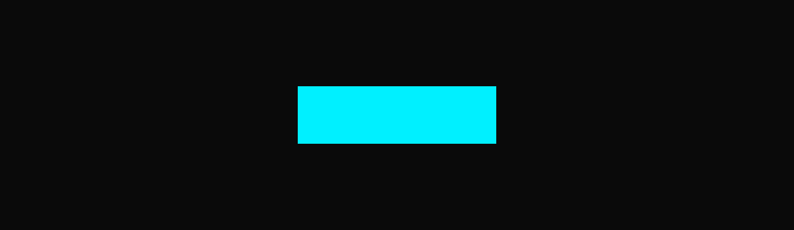

GrokInstall — VS Code Extension Media Assets (v1)
===================================================

Target paths in the extension repo
----------------------------------
Place each file at the following path inside `vscode-grok-yaml/`:

  vscode-grok-yaml/media/icon.png        (128x128, transparent background)
  vscode-grok-yaml/media/icon-dark.png   (128x128, #0A0A0A background fallback)
  vscode-grok-yaml/media/banner.png      (1376x400, Marketplace gallery banner)

Wire-up in package.json (reference, for Claude Code or manual edit):

  "icon": "media/icon.png",
  "galleryBanner": {
    "color": "#0A0A0A",
    "theme": "dark"
  }

And in the Marketplace-facing README.md, directly under the title:

  

Locked brand hex values used in these assets
--------------------------------------------
  Background (deep space black)     #0A0A0A
  Primary neon (cyan)               #00F0FF
  Success neon (green)              #00FF9D
  Primary text                      #FFFFFF
  Secondary text                    #E5E5E5
  Tertiary text                     rgba(255, 255, 255, 0.5)
  Surface (glass fills)             rgba(255, 255, 255, 0.04)
  Border subtle                     rgba(0, 240, 255, 0.15)
  Border focused                    rgba(0, 240, 255, 0.40)

No other colors appear in these assets. No drop shadows. Neon glow only.

Version
-------
These are version 1 of the icon + banner pair.

If you want to iterate — tighter crop, different headline, a seasonal
variant, a larger or smaller mark, a lighter-weight editor mockup, etc. —
just ask in the same Claude Design project ("Grok Install Eco System")
so the saved GrokInstall design system stays calibrated. Starting a new
project would re-bootstrap the tokens and risk drift.

Legal
-----
GrokInstall is an independent community project. Not affiliated with
xAI, Grok, or X.
