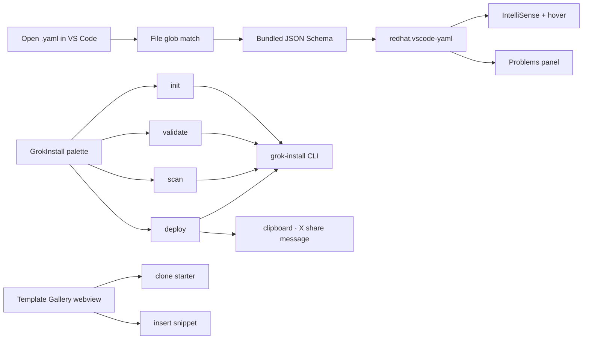

<!-- NEON / CYBERPUNK REPO TEMPLATE · VSCODE-GROK-YAML -->

<h1 align="center">⚡ GrokInstall YAML for VS Code</h1>

  <b>Go from empty folder to shipped agent without leaving the editor.</b> 
  Schema-aware IntelliSense · inline diagnostics · safety scanning · glassmorphic template gallery.

  

  
  
  
  
  

  

---

## ✦ See It In Action

<table>
  <tr>
    <td width="50%">

<svg xmlns="http://www.w3.org/2000/svg" viewBox="0 0 500 260" width="100%">
  <rect width="500" height="260" fill="#0A0D14" rx="8"/>
  <rect width="500" height="30" fill="#0F1420" rx="8"/>
  <rect y="22" width="500" height="8" fill="#0F1420"/>
  <circle cx="14" cy="15" r="4" fill="#FF5F56"/>
  <circle cx="32" cy="15" r="4" fill="#FFBD2E"/>
  <circle cx="50" cy="15" r="4" fill="#27C93F"/>
  <text x="210" y="20" fill="#8899A6" font-family="monospace" font-size="11">grok-voice.yaml</text>
  <text x="20" y="70" fill="#556677" font-family="monospace" font-size="12">1</text>
  <text x="44" y="70" fill="#7C3AED" font-family="monospace" font-size="12">voice_profile</text>
  <text x="146" y="70" fill="#EAF8FF" font-family="monospace" font-size="12">:</text>
  <text x="20" y="92" fill="#556677" font-family="monospace" font-size="12">2</text>
  <text x="60" y="92" fill="#FF4FD8" font-family="monospace" font-size="12">tone</text>
  <text x="96" y="92" fill="#EAF8FF" font-family="monospace" font-size="12">:</text>
  <rect x="108" y="82" width="2" height="12" fill="#00E5FF"><animate attributeName="opacity" values="1;0;1" dur="1.2s" repeatCount="indefinite"/></rect>
  <rect x="106" y="100" width="220" height="135" fill="#12161F" stroke="#00E5FF" stroke-opacity="0.5" rx="4"/>
  <rect x="106" y="100" width="220" height="27" fill="#00E5FF" fill-opacity="0.18"/>
  <text x="118" y="118" fill="#00E5FF" font-family="monospace" font-size="11">▸ casual</text>
  <text x="285" y="118" fill="#556677" font-family="monospace" font-size="9">str</text>
  <text x="118" y="140" fill="#EAF8FF" font-family="monospace" font-size="11">formal</text>
  <text x="285" y="140" fill="#556677" font-family="monospace" font-size="9">str</text>
  <text x="118" y="162" fill="#EAF8FF" font-family="monospace" font-size="11">enthusiastic</text>
  <text x="285" y="162" fill="#556677" font-family="monospace" font-size="9">str</text>
  <text x="118" y="184" fill="#EAF8FF" font-family="monospace" font-size="11">contemplative</text>
  <text x="285" y="184" fill="#556677" font-family="monospace" font-size="9">str</text>
  <text x="118" y="206" fill="#EAF8FF" font-family="monospace" font-size="11">authoritative</text>
  <text x="285" y="206" fill="#556677" font-family="monospace" font-size="9">str</text>
  <text x="118" y="228" fill="#EAF8FF" font-family="monospace" font-size="11">analytical</text>
  <text x="285" y="228" fill="#556677" font-family="monospace" font-size="9">str</text>
  <text x="20" y="252" fill="#00E5FF" font-family="monospace" font-size="10" font-weight="700" letter-spacing="2">INTELLISENSE · 6 COMPLETIONS</text>
</svg>

</td>
    <td width="50%">

<svg xmlns="http://www.w3.org/2000/svg" viewBox="0 0 500 260" width="100%">
  <rect width="500" height="260" fill="#0A0D14" rx="8"/>
  <rect width="500" height="30" fill="#0F1420" rx="8"/>
  <rect y="22" width="500" height="8" fill="#0F1420"/>
  <circle cx="14" cy="15" r="4" fill="#FF5F56"/>
  <circle cx="32" cy="15" r="4" fill="#FFBD2E"/>
  <circle cx="50" cy="15" r="4" fill="#27C93F"/>
  <text x="210" y="20" fill="#8899A6" font-family="monospace" font-size="11">grok-voice.yaml</text>
  <text x="20" y="70" fill="#556677" font-family="monospace" font-size="12">1</text>
  <text x="44" y="70" fill="#7C3AED" font-family="monospace" font-size="12">voice_profile</text>
  <text x="146" y="70" fill="#EAF8FF" font-family="monospace" font-size="12">:</text>
  <text x="20" y="92" fill="#556677" font-family="monospace" font-size="12">2</text>
  <text x="60" y="92" fill="#FF4FD8" font-family="monospace" font-size="12">tone</text>
  <text x="96" y="92" fill="#EAF8FF" font-family="monospace" font-size="12">:</text>
  <text x="110" y="92" fill="#27C93F" font-family="monospace" font-size="12">"casual"</text>
  <text x="20" y="114" fill="#556677" font-family="monospace" font-size="12">3</text>
  <text x="60" y="114" fill="#FF4FD8" font-family="monospace" font-size="12">pace</text>
  <rect x="56" y="103" width="44" height="16" fill="#FF4FD8" fill-opacity="0.15" stroke="#FF4FD8" stroke-opacity="0.5"/>
  <text x="102" y="114" fill="#EAF8FF" font-family="monospace" font-size="12">:</text>
  <text x="116" y="114" fill="#FFBD2E" font-family="monospace" font-size="12">1.2</text>
  <rect x="60" y="132" width="330" height="96" fill="#12161F" stroke="#FF4FD8" stroke-opacity="0.6" rx="4"/>
  <rect x="60" y="132" width="330" height="24" fill="#FF4FD8" fill-opacity="0.12"/>
  <text x="72" y="149" fill="#FF4FD8" font-family="monospace" font-size="11" font-weight="700">pace</text>
  <text x="110" y="149" fill="#8899A6" font-family="monospace" font-size="10">(number, 0.5 – 2.0)</text>
  <text x="72" y="174" fill="#EAF8FF" font-family="monospace" font-size="11">Speech rate multiplier for voice</text>
  <text x="72" y="192" fill="#EAF8FF" font-family="monospace" font-size="11">synthesis. Applied per utterance.</text>
  <text x="72" y="216" fill="#27C93F" font-family="monospace" font-size="10">Default: 1.0 · Schema: v2.12</text>
  <text x="20" y="252" fill="#FF4FD8" font-family="monospace" font-size="10" font-weight="700" letter-spacing="2">HOVER · SCHEMA DOCS INLINE</text>
</svg>

</td>
  </tr>
  <tr>
    <td>

<svg xmlns="http://www.w3.org/2000/svg" viewBox="0 0 500 260" width="100%">
  <rect width="500" height="260" fill="#0A0D14" rx="8"/>
  <rect width="500" height="30" fill="#0F1420" rx="8"/>
  <rect y="22" width="500" height="8" fill="#0F1420"/>
  <circle cx="14" cy="15" r="4" fill="#FF5F56"/>
  <circle cx="32" cy="15" r="4" fill="#FFBD2E"/>
  <circle cx="50" cy="15" r="4" fill="#27C93F"/>
  <text x="226" y="20" fill="#8899A6" font-family="monospace" font-size="11">zsh · scan</text>
  <text x="20" y="70" fill="#00E5FF" font-family="monospace" font-size="12">$</text>
  <text x="36" y="70" fill="#EAF8FF" font-family="monospace" font-size="12">grok-install scan</text>
  <line x1="20" y1="82" x2="470" y2="82" stroke="#556677" stroke-opacity="0.4"/>
  <text x="20" y="104" fill="#27C93F" font-family="monospace" font-size="13">✓</text>
  <text x="40" y="104" fill="#EAF8FF" font-family="monospace" font-size="12">Schema validation</text>
  <text x="410" y="104" fill="#27C93F" font-family="monospace" font-size="11" font-weight="700">PASS</text>
  <text x="20" y="126" fill="#27C93F" font-family="monospace" font-size="13">✓</text>
  <text x="40" y="126" fill="#EAF8FF" font-family="monospace" font-size="12">No hardcoded keys</text>
  <text x="410" y="126" fill="#27C93F" font-family="monospace" font-size="11" font-weight="700">PASS</text>
  <text x="20" y="148" fill="#FFBD2E" font-family="monospace" font-size="13">⚠</text>
  <text x="40" y="148" fill="#EAF8FF" font-family="monospace" font-size="12">Rate limit missing (post_thread)</text>
  <text x="410" y="148" fill="#FFBD2E" font-family="monospace" font-size="11" font-weight="700">WARN</text>
  <text x="20" y="170" fill="#FF2D55" font-family="monospace" font-size="13">✗</text>
  <text x="40" y="170" fill="#EAF8FF" font-family="monospace" font-size="12">require_human_approval missing</text>
  <text x="410" y="170" fill="#FF2D55" font-family="monospace" font-size="11" font-weight="700">FAIL</text>
  <line x1="20" y1="190" x2="470" y2="190" stroke="#556677" stroke-opacity="0.4"/>
  <text x="20" y="216" fill="#EAF8FF" font-family="monospace" font-size="12">Safety score:</text>
  <text x="118" y="216" fill="#FFBD2E" font-family="monospace" font-size="14" font-weight="700">72 / 100</text>
  <rect x="200" y="205" width="70" height="16" fill="#FFBD2E" fill-opacity="0.15" stroke="#FFBD2E" stroke-opacity="0.6" rx="2"/>
  <text x="212" y="216" fill="#FFBD2E" font-family="monospace" font-size="11" font-weight="700">YELLOW</text>
  <text x="20" y="252" fill="#FFBD2E" font-family="monospace" font-size="10" font-weight="700" letter-spacing="2">SAFETY SCANNER · SEVERITY-AWARE</text>
</svg>

</td>
    <td>

<svg xmlns="http://www.w3.org/2000/svg" viewBox="0 0 500 260" width="100%">
  <defs>
    <linearGradient id="g" x1="0%" y1="0%" x2="0%" y2="100%">
      <stop offset="0%" stop-color="#FFFFFF" stop-opacity="0.06"/>
      <stop offset="100%" stop-color="#FFFFFF" stop-opacity="0.02"/>
    </linearGradient>
  </defs>
  <rect width="500" height="260" fill="#0A0D14" rx="8"/>
  <rect width="500" height="30" fill="#0F1420" rx="8"/>
  <rect y="22" width="500" height="8" fill="#0F1420"/>
  <text x="192" y="20" fill="#8899A6" font-family="monospace" font-size="11">Template Gallery</text>
  <rect x="20" y="50" width="220" height="82" fill="url(#g)" stroke="#00E5FF" stroke-opacity="0.35" rx="6"/>
  <circle cx="40" cy="70" r="8" fill="#00E5FF" fill-opacity="0.3" stroke="#00E5FF"/>
  <text x="58" y="75" fill="#EAF8FF" font-family="monospace" font-size="12" font-weight="700">hello-grok</text>
  <text x="30" y="100" fill="#8899A6" font-family="monospace" font-size="10">Simplest possible agent.</text>
  <text x="30" y="118" fill="#00E5FF" font-family="monospace" font-size="9">single-agent · standard</text>
  <rect x="260" y="50" width="220" height="82" fill="url(#g)" stroke="#7C3AED" stroke-opacity="0.35" rx="6"/>
  <circle cx="280" cy="70" r="8" fill="#7C3AED" fill-opacity="0.3" stroke="#7C3AED"/>
  <text x="298" y="75" fill="#EAF8FF" font-family="monospace" font-size="12" font-weight="700">reply-bot</text>
  <text x="270" y="100" fill="#8899A6" font-family="monospace" font-size="10">X mention-reply with gate.</text>
  <text x="270" y="118" fill="#7C3AED" font-family="monospace" font-size="9">multi-step · strict</text>
  <rect x="20" y="142" width="220" height="82" fill="url(#g)" stroke="#FF4FD8" stroke-opacity="0.35" rx="6"/>
  <circle cx="40" cy="162" r="8" fill="#FF4FD8" fill-opacity="0.3" stroke="#FF4FD8"/>
  <text x="58" y="167" fill="#EAF8FF" font-family="monospace" font-size="12" font-weight="700">research-swarm</text>
  <text x="30" y="192" fill="#8899A6" font-family="monospace" font-size="10">Researcher + critic + publisher.</text>
  <text x="30" y="210" fill="#FF4FD8" font-family="monospace" font-size="9">swarm · standard</text>
  <rect x="260" y="142" width="220" height="82" fill="url(#g)" stroke="#00D5FF" stroke-opacity="0.35" rx="6"/>
  <circle cx="280" cy="162" r="8" fill="#00D5FF" fill-opacity="0.3" stroke="#00D5FF"/>
  <text x="298" y="167" fill="#EAF8FF" font-family="monospace" font-size="12" font-weight="700">voice-agent-x</text>
  <text x="270" y="192" fill="#8899A6" font-family="monospace" font-size="10">Speak, review, approve, publish.</text>
  <text x="270" y="210" fill="#00D5FF" font-family="monospace" font-size="9">multi-step · strict</text>
  <text x="20" y="252" fill="#00D5FF" font-family="monospace" font-size="10" font-weight="700" letter-spacing="2">TEMPLATE GALLERY · GLASSMORPHIC</text>
</svg>

</td>
  </tr>
</table>

Live mockups. Zero external assets. Real screenshots drop in on v1.0 publish.

<b>Screenshot captions</b>

- **Top-left:** IntelliSense completing a `reply_to_mention` key
- **Top-right:** Hover tooltip on `voice_profile.tone`
- **Bottom-left:** Scanner flagging a rate-limit risk
- **Bottom-right:** Glassmorphic template gallery panel

Assets marked as placeholders are dropped in by Claude Design before publish — see `PUBLISH.md`.

## ✦ Features

<table>
  <tr>
    <td width="50%">
      <h3>🧠 Schema-Backed IntelliSense</h3>
      
Completion, hover docs, and inline diagnostics for all five Grok spec formats — powered by the bundled <code>redhat.vscode-yaml</code> dependency.

    </td>
    <td width="50%">
      <h3>🛡️ Safety Scanner Integration</h3>
      
Runs <code>grok-install scan</code> with severity-aware notifications and a streaming output log. Ship safer agents by default.

    </td>
  </tr>
  <tr>
    <td>
      <h3>⌨️ Command Palette Coverage</h3>
      
Eight <code>GrokInstall:</code> commands — init, validate (file + project), scan, deploy, copy install link, share.

    </td>
    <td>
      <h3>📝 Context-Aware Snippets</h3>
      
Five prefixes expand into schema-valid defaults with tab stops — reply, thread, voice, trend, swarm.

    </td>
  </tr>
  <tr>
    <td>
      <h3>🎨 Glassmorphic Template Gallery</h3>
      
Clone starter projects or drop a snippet into the current file. Dark-premium UI, live-previewable.

    </td>
    <td>
      <h3>🔗 One-Click Share</h3>
      
Deploy copies a ready-to-post X message with your install link to the clipboard. Zero friction from ship to share.

    </td>
  </tr>
</table>

## ✦ Supported Spec Files

  
  
  
  
  

## ✦ How It Works

## ✦ Commands

Every command is prefixed `GrokInstall:` in the palette.

| Command | Suggested shortcut | What it does |
|---|---|---|
| `New Agent from Template` | `Cmd+Alt+N` | Wizard (name + category) then runs `grok-install init` in a terminal |
| `Validate Current Spec` | `Cmd+Alt+V` | Validates the active file, pushes diagnostics into Problems |
| `Validate Entire Project` | `Cmd+Alt+Shift+V` | Scans the full workspace with `grok-install validate --project` |
| `Run Safety Scanner` | `Cmd+Alt+S` | Runs `grok-install scan` with progress notifications |
| `Deploy Agent` | `Cmd+Alt+D` | Deploys, copies a ready-to-post X share message |
| `Copy Install Link` | `Cmd+Alt+L` | Generates and copies the install link to clipboard |
| `Open grokagents.dev Marketplace` | — | Opens the public marketplace in your browser |
| `Open Template Gallery` | `Cmd+Alt+G` | Opens the glassmorphic template gallery webview |

> Assign the shortcuts from `File > Preferences > Keyboard Shortcuts` — the suggestions above are not pre-bound to avoid stomping your setup.

## ✦ Snippets

Type any of the prefixes below inside a `.yaml` file. The snippet fills in schema-valid defaults with tab stops for quick customization.

| Prefix | Expands into | Target file |
|---|---|---|
| `grok:reply` | `capabilities.reply_to_mention` block | `capabilities.yaml` |
| `grok:thread` | `thread_posting` + `post_thread` | `grok-agent.yaml` |
| `grok:voice` | Full `voice_profile` + `response` block | `grok-voice.yaml` |
| `grok:trend` | `trend_pipeline` + `post_thread` combo | `grok-agent.yaml` |
| `grok:swarm` | `orchestrator` + `agents` + `fallback` | `grok-swarm.yaml` |

## ✦ Install

<table>
  <tr>
    <td width="33%">
      <h3>1️⃣ Extension</h3>
      
Install <b>GrokInstall YAML</b> from the VS Code Marketplace.

    </td>
    <td width="33%">
      <h3>2️⃣ CLI</h3>
      
<code>npm install -g grok-install</code>

    </td>
    <td width="33%">
      <h3>3️⃣ First Agent</h3>
      
Command palette → <b>GrokInstall: New Agent from Template</b>.

    </td>
  </tr>
</table>

## ✦ Why GrokInstall?

GrokInstall turns a YAML spec into a shippable Grok agent on X. The CLI handles validation, safety scanning, and deployment. **This extension puts that entire loop inside your editor** — author with IntelliSense, catch issues before `deploy`, and share an install link that lets anyone install your agent with a single click.

The full stack is open and independent:

<table>
  <tr>
    <td width="25%">
      <h3>📦 Core Spec</h3>
      <a href="https://github.com/AgentMindCloud/grok-install">grok-install →</a>
    </td>
    <td width="25%">
      <h3>📐 Standards</h3>
      <a href="https://github.com/AgentMindCloud/grok-yaml-standards">grok-yaml-standards →</a>
    </td>
    <td width="25%">
      <h3>⚙️ CLI</h3>
      <a href="https://github.com/AgentMindCloud/grok-install-cli">grok-install-cli →</a>
    </td>
    <td width="25%">
      <h3>🛒 Marketplace</h3>
      <a href="https://grokagents.dev">grokagents.dev →</a>
    </td>
  </tr>
</table>

**Build an agent once, publish it everywhere.**

## ✦ Sibling Repos

<table>
  <tr>
    <td width="33%">
      <h3>📦 grok-install</h3>
      
The universal YAML spec this extension validates.

      <a href="https://github.com/agentmindcloud/grok-install">Repository →</a>
    </td>
    <td width="33%">
      <h3>⚙️ grok-install-cli</h3>
      
The CLI this extension orchestrates on your behalf.

      <a href="https://github.com/agentmindcloud/grok-install-cli">Repository →</a>
    </td>
    <td width="33%">
      <h3>📐 grok-yaml-standards</h3>
      
The schema registry powering IntelliSense.

      <a href="https://github.com/agentmindcloud/grok-yaml-standards">Repository →</a>
    </td>
  </tr>
  <tr>
    <td>
      <h3>🌟 awesome-grok-agents</h3>
      
10 certified templates browsable from the gallery.

      <a href="https://github.com/agentmindcloud/awesome-grok-agents">Repository →</a>
    </td>
    <td>
      <h3>📚 grok-docs</h3>
      
Full docs — spec reference, CLI reference, guides.

      <a href="https://github.com/agentmindcloud/grok-docs">Repository →</a>
    </td>
    <td>
      <h3>🤖 grok-install-action</h3>
      
GitHub Action that validates every PR with the same scanner.

      <a href="https://github.com/agentmindcloud/grok-install-action">Repository →</a>
    </td>
  </tr>
</table>

## ✦ Connect

  
  
  

## ✦ Disclaimer

GrokInstall is an independent community project. **Not affiliated with xAI, Grok, or X.**

## ✦ License

Apache 2.0.

  

